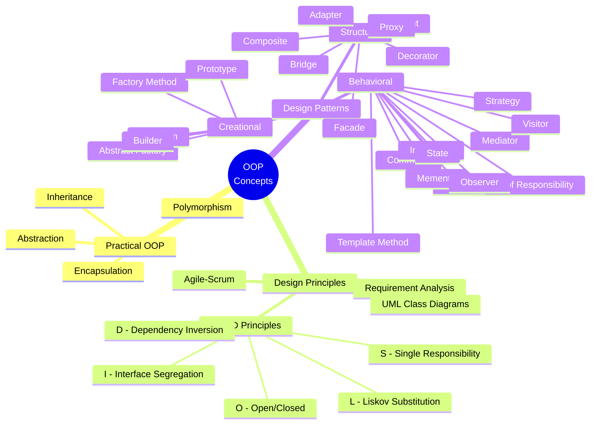

# OOP Concepts

## Part 1: Practical OOP

Explains practical application of OO Concepts (Abstraction, Encapsulation, Inheritance, and Polymorphism) with day-to-day concrete examples. 

### Key Concepts
- **Abstraction**: Hiding complex implementation details and showing only essential features.
  
- **Encapsulation**: Bundling the data and methods that operate on the data within a single unit (class).

- **Inheritance**: Mechanism where a new class inherits properties and behavior from an existing class.

- **Polymorphism**: Ability of different classes to respond to the same method call in different ways.

---

## Part 2: Object Oriented Design Principles

1. **Agile-Scrum Methodology**  
   Scrum is an agile process framework for managing complex product development.
   
2. **Requirement Analysis with UML Use Case Diagrams**  
   Visualize functional requirements and interactions between the system and users.

3. **OO Design with UML Class Diagrams**  
   Diagram that represents the structure of the system, showing classes, attributes, methods, and their relationships.

4. **Mapping UML Class Diagram Relationships into Java Implementation**  
   Mapping associations, compositions, and inheritance into Java code using appropriate keywords.

Please refer to the below article for more details:  
https://medium.com/lexicon-digital/inside-the-object-oriented-toolbox-mapping-between-design-implementation-405f00e22bd

5. **SOLID Principles Explained with Concrete Examples**  
   The **SOLID** principles are a set of design principles that help software developers design more understandable, flexible, and maintainable code.  
   
   - **S**: Single Responsibility Principle
   - **O**: Open/Closed Principle
   - **L**: Liskov Substitution Principle
   - **I**: Interface Segregation Principle
   - **D**: Dependency Inversion Principle

Please refer to the below article for more details:  
https://wimal-perera.medium.com/inside-the-object-oriented-toolbox-avoiding-bad-design-with-solid-principles-b8eb256c968c

6. **How SOLID Principles Are Violated During Early Sprints of an Agile Driven Project**  
   Due to lack of requirement clarity and fast delivery, it is common to see violations of the SOLID principles.

7. **Achieving Stepwise SOLID Compliance in Already Violated Implementation**  
   Gradual adherence to SOLID principles over successive sprints improves code maintainability.

### SOLID Principles Compliance

| Principle | Early Sprint Violations | Steps for Compliance |
|-----------|-------------------------|----------------------|
| **S** | Classes doing multiple things | Refactor classes to focus on one responsibility |
| **O** | Code changes require modifying existing classes | Use interfaces and inheritance to extend functionality without altering base classes |
| **L** | Child class violates base class expectations | Ensure proper override behavior and testing |
| **I** | Large interfaces with many methods | Break down large interfaces into smaller, focused ones |
| **D** | High-level modules depend on low-level modules | Introduce dependency injection to reduce coupling |

Please refer to the below article for more details:  
https://medium.com/lexicon-digital/developing-agile-driven-software-whilst-adhering-with-best-engineering-practices-261a6aabe7a5

---

## Part 3: Object Oriented Design Patterns

1. **Introducing Design Patterns (Creational, Structural, and Behavioral)**  
   Design patterns are reusable solutions to common problems in software design.

2. **In-depth Analysis on Creational Design Patterns**  
   Creational patterns deal with object creation mechanisms, trying to create objects in a manner suitable to the situation.  
   
   **When to use:**  
   - When the system should be independent of how its objects are created, composed, and represented.  
   
   **When not to use:**  
   - When the system doesn't need flexible object creation.

---

## Conceptual Mind Map

Here is a mind map showing the relationships between the OOP concepts, design principles, and patterns:

### Types of Design Patterns

1. **Creational Design Patterns**  
   These patterns deal with object creation mechanisms, trying to create objects in a manner suitable to the situation. They provide flexibility in deciding which objects need to be created for a given scenario.  
   **Examples**:
   - **Factory Method**  
   - **Abstract Factory**
   - **Singleton**
   - **Builder**
   - **Prototype**

2. **Structural Design Patterns**  
   These patterns deal with object composition, creating relationships between objects to form larger structures. They help ensure that classes and objects can work together by promoting composability and reusability.  
   **Examples**:
   - **Adapter**
   - **Bridge**
   - **Composite**
   - **Decorator**
   - **Facade**
   - **Flyweight**
   - **Proxy**

3. **Behavioral Design Patterns**  
   These patterns focus on communication between objects, what happens when objects interact, and how responsibilities are distributed. They define how objects collaborate to fulfill a task.  
   **Examples**:
   - **Chain of Responsibility**
   - **Command**
   - **Interpreter**
   - **Iterator**
   - **Mediator**
   - **Memento**
   - **Observer**
   - **State**
   - **Strategy**
   - **Template Method**
   - **Visitor**

---

